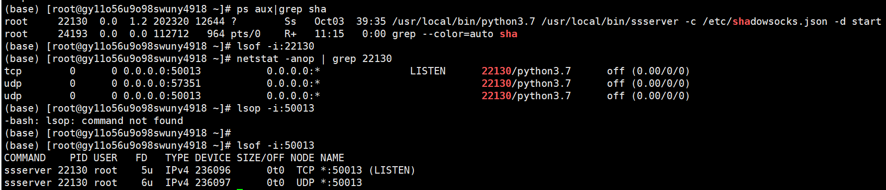

1、查看运行的程序的pid(线程号)  ps aux | grep sha(程序的名字)

2、根据线程号查询正在运行的程序的port(端口号) netstat -anop | grep pid(程序的线程号)

3、查看port(端口号)对应的正在运行的程序以及pid(线程号)  lsof -i:port(端口号)

# [linux,windows10常用操作指令](https://www.cnblogs.com/qiaoer1993/p/12083583.html)

### Linux

1、清理缓存，释放内存  echo 3 > /proc/sys/vm/drop_caches

2、通过端口号查询占用该端口运行的程序 lsof -i:port

3、获取Gunicorn进程树：pstree -ap | grep gunicorn

4、获取该命令下运行的程序：ps aux | grep gunicorn

5、获取该命令下运行的文件：ps -ef | grep gunicorn

6、根据pid查找文件路径：ll /proc/12499/cwd

7、下面的命令可以清理掉所有处于终止状态的容器。

　　$ docker container prune

###  windows10

1、查看某个端口被那个线程号占用 netstat -aon|findstr port

2、查看该线程号下运行的程序 tasklist|findstr pid

3、杀掉后台运行的程序 taskkill /f /t /im WXDrive.exe

4、修改hosts文件，并使之生效 C:\Windows\System32\drivers\etc\hosts，在CMD窗口输入ipconfig /flushdns刷新DNS解析缓存。